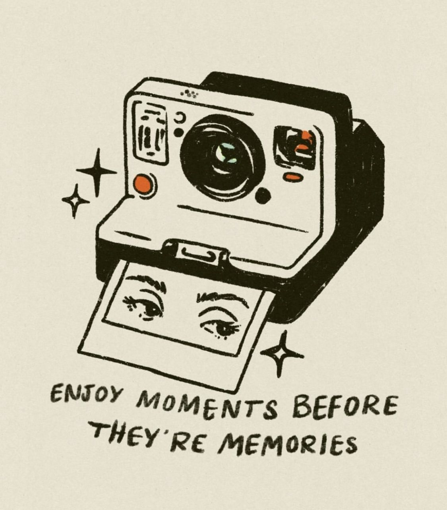

# Polaroid Carousel

A retro-themed web application that lets users create, customize, and share vintage Polaroid-style images. Built with Next.js and React.



## Features

- Upload and display images in vintage Polaroid frames
- Add custom captions to your Polaroids
- Choose from multiple vintage themes (Sepia, Monochrome, Vintage, Classic)
- Download your creations as images
- Share to Farcaster (coming soon)
- Authentic retro styling with animations and effects

## Getting Started

First, run the development server:

```bash
npm run dev
# or
yarn dev
```

Open [http://localhost:3000](http://localhost:3000) with your browser to see the result.

## Tech Stack

- [Next.js](https://nextjs.org) - React framework
- [Tailwind CSS](https://tailwindcss.com) - Styling
- [html2canvas](https://html2canvas.hertzen.com) - For image export functionality
- Custom animations and styling for vintage effects

## Learn More

To learn more about Next.js, take a look at the following resources:

- [Next.js Documentation](https://nextjs.org/docs) - learn about Next.js features and API.
- [Learn Next.js](https://nextjs.org/learn) - an interactive Next.js tutorial.

You can check out [the Next.js GitHub repository](https://github.com/vercel/next.js) - your feedback and contributions are welcome!

## Deploy on Vercel

The easiest way to deploy your Next.js app is to use the [Vercel Platform](https://vercel.com/new?utm_medium=default-template&filter=next.js&utm_source=create-next-app&utm_campaign=create-next-app-readme) from the creators of Next.js.

Check out our [Next.js deployment documentation](https://nextjs.org/docs/app/building-your-application/deploying) for more details.
